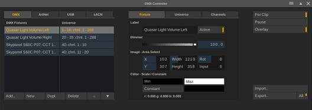
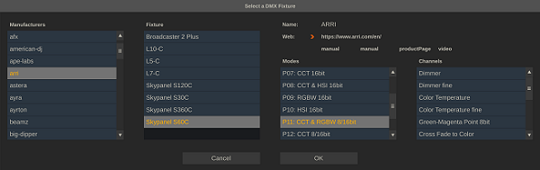
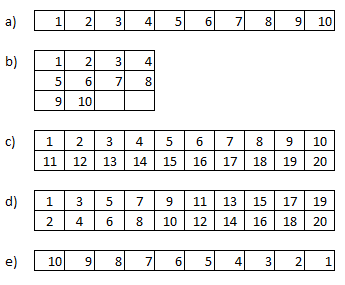
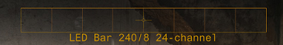
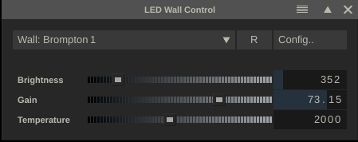

# DMX, Lighting, and LED Wall Control

<h2 id="dmx-2">DMX</h2>

With the DMX module in Live FX you can control on-set lights, based on the media that is played back on the LED wall, the background used with a green-screen setup or tied to any other media upon which the lighting should act. You start the DMX module from the Live FX menu in the player or from the Tools dropdown menu in the player top menu bar. Some know how about DMX is required to operate this module. Although any low-level hardware aspects might not be needed, a basic understanding of the concepts of DMX channels, -universes, -controllers and -devices is needed to operate the module. On the web are various starter tutorial sites and videos available.

Configuring and using the DMX functions involves 3 steps:

<ul>
    <li>Connecting to DMX controller(s) / device(s).</li>
    <li>    Configure Fixture(s): select or create lights and the channel layout to be used with the lights.</li>
    <li>    Link the light to a specific part of an image to set its color dynamically during playback of the media.</li>
</ul>
<h3 id="dmx-controllers-devices">DMX Controllers / Devices</h3>

The DMX module supports three interfaces for connecting to a DMX device:

<ul>
    <li><strong>USB </strong>– supporting Enttec devices which in turn connect to a light/fixture using XLR.</li>
    <li><strong>ArtNet</strong>. This uses Ethernet to connect to one or more DMX devices. This device might be a light/fixture with the Art Net interface build in or it might be a controller that in turn connects to the lights/fixtures through a serial connection.</li>
    <li><strong>sACN</strong>. This also uses Ethernet to connect to a DMX device but can use multi-cast option where the DMX Universe is part of the Ip address, which makes settings up a high number of fixtures a bit easier.</li>
</ul>

To manage the connections, use the corresponding tabs in the DMX panel. When starting the DMX function, the software automatically scans for Art Net and USB devices. Since sACN uses a multi-case protocol, it does not specific (listening) devices. Use the <strong>Refresh </strong>button to scan again if you connected new ArtNet or USB devices to the network/computer while the panel was already started. 

Note that all three protocols can be used at the same time. Each protocol is tied to a one or a range of universes. The data for any fixture that is linked a universe is send through all protocols that are also tied to the universe. 

<h4 id="artnet">ArtNet</h4>
<h5 id="adapters">Adapters</h5>

If the system has multiple network adapters, then select the adapter to scan for ArtNet devices.

<h5 id="active-nodes">Active Nodes</h5>

All ArtNet devices/controllers found are listed in the <strong>Active Nodes</strong> table. That table also shows the Ip address of the nodes as well as the DMX Universes the nodes are using.

<h5 id="sub-net">Sub-Net</h5>

An ArtNet device can have a specific sub-net set to be used in addressing the device. If you want to address that device, then the Sub-net settings should have the same value. Usually this is 0. The main Net number for the DMX ArtNet module in the software is currently always 0.

<h5 id="port-universes">Port Universes</h5>

By default the DMX ArtNet implementation has 4 output ports, where each port can address a different DMX Universe. You can alter the DMX Universe to any value in the 1-16 range.

<h4 id="usb-devices">USB Devices</h4>

All devices found are listed in the table where the name and serial number are displayed as well as the DMX Universe that the device is linked to. You can change the DMX Universe by clicking the column and entering a different number [1-16].

<h4 id="sacn">sACN</h4>

The sACN protocol need to be explicitly enabled using the <strong>Multi-cast</strong> on/off toggle. In case the system has multiple network adapters, select the <strong>Adapter</strong> to use to send the data over. Next, specify the universe range to be used with the protocol. This can be any range in between 1 and 65536. Any data for any fixtures that are tied to a universe in that range is send with sACN.

<h3 id="fixture-setup">Fixture Setup</h3>
<h4 id="manage-fixtures">Manage Fixtures</h4>

The first tab on the DMX Controller lists all the available fixtures / lights. The second set of tabs (Fixture, Universe, Channels) contains the settings of the selected fixture.

<h5 id="add">Add</h5>

This opens a new panel with a list of predefined fixtures. The first time you open this list, it will show empty, but a download will automatically start to retrieve a list of existing fixtures. When the list is populated, select a manufacturer, the fixture and then the mode it should operate in. This will then determine the DMX channel layout for the fixture. Click OK to add the selected fixture to your setup.

<h5 id="new">New</h5>

Click New to create a new ‘empty’ fixture for which you will enter the DMX channel layout yourself.

<h5 id="dupl">Dupl</h5>

Duplicate / make a copy of the current selected fixture.

<h5 id="delete">Delete</h5>

Remove the selected fixture from your setup.

<h5 id="up-down">Up / Down</h5>

Move the position of the selected fixture in the list of fixtures.

<h4 id="configure-fixtures">Configure Fixtures</h4>
<h5 id="universe">Universe</h5>

In the Universe tab you set the number of channels that a fixture uses and assign the fixture its position within one or more DMX universe(s). 

<ul>
    <li>The <strong>Universe </strong>number assigns the fixture to a specific universe.</li>
    <li>The <strong>Start </strong>number assigns the first channel number within that universe the fixture uses (a universe has a max of 512 channels).</li>
    <li>The number of <strong>Channels </strong>specifies how many channels the fixture uses in total.</li>
    <li>The <strong>Globals </strong>counter indicates how many of the channels of a fixture are only used once (at the end) if the fixture has a repeat count. Some fixtures are&nbsp; build up of a number of lights. You only specify the single light channel usages and then use the Repeat in Universe control to indicate how many times this light is to be repeated. The global channels are not repeated with each light and only added after the all the repetitions. The global channels are usually used to control a setting that applies to all repeated lights.</li>
    <li>The <strong>Repeat in Universe</strong> specifies how many times the channel layout of the fixture is to be repeated. A light-beam can consists of e.g. 24 lights, each using 6 DMX channels. The Channels counter would indicate 6 while the Repeat in Universe would indicate 24.</li>
    <li>With the<strong> Repeat the Universe</strong> setting you can duplicate the specified universe. To follow the above example. If you would have a total of 16 of the light-beams (mounted together), then you do not have to specify them each separately, but can just set the Repeat the Universe to 16. If the first beam was set to Universe 24, the next 15 beams would use universe 24 - 40. This functionality is particularly useful with the sACN protocol that multi-casts the dmx data based on universe number.</li>
</ul>
<h5 id="color-sampling">Color Sampling</h5>

The <strong>Distribute</strong>, <strong>Segments</strong>, <strong>Order </strong>and <strong>Inverse </strong>controls in the Universe tab are used to determine how the color for the fixtures is sampled from the active clip that is playing. Each fixture is can be tied to a specific section (rectangle) of the image playing. In the case that a fixture is made up from multiple lights and/or you have been using the Repeat options, then you also need to specify how the color sampling maps to the various lights.

The first option is the either <strong>Duplicate </strong>the color sampling and use the same average color for all repeated lights or to <strong>Distribute </strong>the color sampling area into multiple smaller areas where each light have its own section: by default the rectangular area is split up in a single row of smaller areas. In the figure below you can see how to adjust the sample mapping.

 

Figure a) displays shows the default distribution of the sample area when using a repetition of 10. By using the <strong>Segments </strong>control you can adjust the number of rows that are using in the sampling area. In figure b) <strong>Segments </strong>is set to 3 and generate a pattern of 3 rows and 4 columns - leaving 2 samples not-used. 

In some fixtures the repeated lights are not following a row-after-row pattern (figure c) but the lights are ordered per column (figure D). In that case you can use the <strong>Order</strong> dropdown to specify an column-order rather than a row-order. This also works if the fixture contains more than 2 rows of lights.

Finally you can <strong>Invert</strong> the order of sampling - figure e) by using the corresponding option.

<h5 id="channels">Channels</h5>

Each property of a fixture is controlled through one or more DMX channels. In the Channels tab you can specify which value to use for each DMX channel. This can be a dynamic value based on active color sampling or it can be a static value. The Channels lists the channels that you specified in the Universe tab. The first column specifies the channel index. If a channel is a Global channel then it is marked as such in this column. The second column specifies the dynamic value to be used for the channel. In the third column you can set a static value that is to be used for the channel. This can be any value between 0 - 255. The documentation of the fixture will specify which values can be used and their meaning. Finally, in the last column you can (optionally) enter a label that clarifies the function of the channel. The possible types of dynamic channel value are:

<ul>
    <li>None. The channel value is not dynamic, the (static) value used is specified in the value column. If no explicit value is set, then 0 is used.</li>
    <li>    Dimmer / Dimmer fine. Control the brightness of the fixture. The value is determined by the slider control on the Fixture tab. If the fixture allows for a two channel dimmer function, for more fine grained control, then use both the ‘fine’ and regular option on subsequent channels.</li>
    <li>    Red / Red fine. Control the Red color channel of the fixture. The value comes from the image (area) that the fixture is linked to.</li>
    <li>    Green / Green fine. Control the Green color channel of the fixture.</li>
    <li>    Blue / Blue fine. Control the Blue color channel of the fixture.</li>
    <li>    White. Control the white color channel of the fixture. The value comes from the luminance of the image (area) that the fixture is linked to.</li>
    <li>OSC. The value is found from the OSC Source Live Link. This requires that the OSC Source Live Link is active. In the description column you enter the OSC tag to be used.</li>
</ul>
<h3 id="fixture-control-and-color-sampling">Fixture Control and Color Sampling</h3>

On the Fixture tab you control the fixture general settings.

<h5 id="name">Name</h5>

Enter / change the fixture label.

<h5 id="active">Active</h5>

When de-activating a fixture that is in a universe with other fixtures that are still active, all channels on the deactivated fixture as set to 0. If there is no other active fixture within that universe then no new data is send to the fixture.

<h5 id="dimmer">Dimmer</h5>

Adjust the brightness of the selected fixture. This only works if the fixture has channels that are linked with a dimmer function.

<h5 id="image-area-select-color-sampling">Image Area Select - Color Sampling</h5>

Each fixture (unless it is set to have a fixed color) is tied to a specific section in the image of the active node in the player. In the Viewport an overlay is displayed that marks this section. This section of the image is used to sample the color for the fixture: the average color of all pixels in the image section. You can adjust the size of the image section of the position by either adjusting the numeric control on the Fixture tab or by dragging the overlay in the Viewport. 

Note that in some cases you need to specify which input of a composition node to use to sample from. E.g. when using a Switcher node, you want to tie the color sampling for a fixture to a specific channel in the Switcher node. Use the <strong>Input </strong>control to specify which channel / input to use. The value 0 indicates to use the main / root node.

<h5 id="color-scale-constant">Color Scale / Constant</h5>

Use the <strong>Min</strong>/<strong>Max </strong>color controls to set a minimum / maximum color that a fixture should receive. When the min/max color is set, then the calculated average color of the image area is scaled within these minimum and maximum colors.

Rather than determining the color for a fixture dynamically from the playback clip, you can also set a constant color for one or more fixtures. For this, enable the <strong>Constant </strong>option and use the color pot next to it to determine the color for the fixture.

<h3 id="other-dmx-controls">Other DMX Controls</h3>

The DMX module has a number of generic functions to control its behavior.

<h5 id="per-clip">Per Clip</h5>

The general fixture setup is stored per project. The settings on the Fixture tab (Active / Dimmer / Area select / Scale / Constant) for all fixtures are however by default stored per clip. If a clip does not have any DMX settings with it, the last known settings are used. However, any change that is made to the settings is only stored with the current active clip. Moving back to an earlier clip will restore the settings for that clip. If you switch the Per Clip setting off, then settings are no longer stored per clip but only a single set of settings are maintained for all clips.

<h5 id="pause">Pause</h5>

(Temporarily) switch off sending any DMX data to the active devices.

<h5 id="overlay-2">Overlay</h5>

(Temporarily) switch off drawing the area select overlays in the View Port.

<h5 id="import-export">Import / Export</h5>

DMX settings are stored in the project database. Use the Export / Import options to save the DMX settings to an external file and load them into another project. Use the <strong>All</strong> option to export the settings of all fixtures or only the current selected. This then also determines the extension of the file: ‘*.fdmx’ for a single fixture vs. ‘*.admx’ for all fixtures.

<h2 id="led-wall-control">LED Wall Control</h2>

In most cases when outputting to an LED wall, the grade and look is all done from withing Live FX. However, it can be very useful to have control over the overall brightness and color temperature of the LED wall. The LED Wall Control utility in Live FX, which is available from the Tools menu in the Player top menu bar - can interface with the Tessera LED Wall Processors from Brompton Ltd.

From the control panel you can adjust the overall brightness of an LED Wall as well as the Intensity Gain and Temperature settings. With the Config option you can define multiple walls, each referencing one or more processors by just adding lines to configuration file. Start each line with a name / wall identifier and add one or more IP-addresses of the processors associated with the wall - separated by a comma.

 
Wall 1, 10.10.10.1, 10.10.10.2, 10.10.10.3

Wall 1, 10.10.10.25, 10.10.10.26

One of the advantages of adjusting the overall brightness of the LED wall rather than adjusting (the grade on) the outgoing signal is that you can use more of the available (limited) bit depth for the nuance of the grade.

