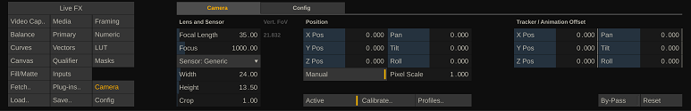
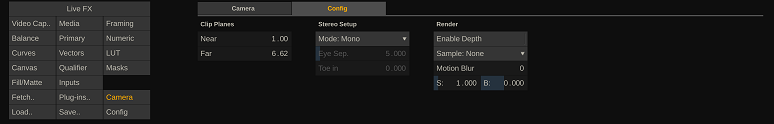
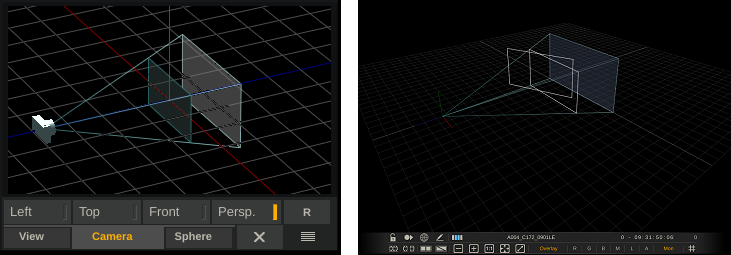
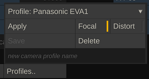
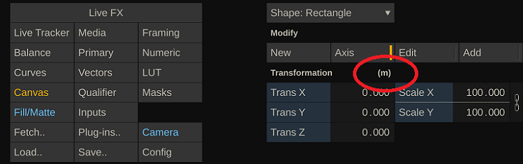
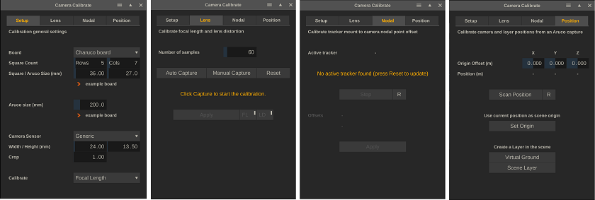
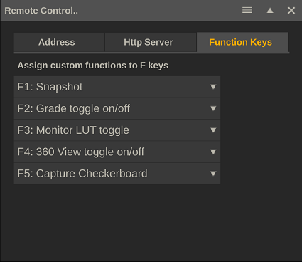
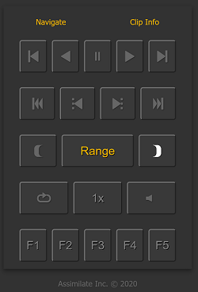

# Virtual Camera and Calibration

<h2 id="virtual-camera">Virtual Camera</h2>

Each shot has its own virtual camera for rendering a scene that includes layers. In such a scene, the primary image (of the clip or live capture) forms the back-plate that is tied to the camera and layers exist in a 3D context. You manage the (virtual) camera settings primarily from the Camera menu.

The PanZoom panel (started from the top menu bar) shows a schematic view of the virtual camera. From the PanZoom tool you can also open a more detailed representation of the virtual camera and layer-setup in 3D space by either selecting the Left-, Top-, Front- or full Perspective view. This opens the detailed view in the View port, replacing the main image view. Use various quick keys to adjust the view: Ctrl+drag or the mouse-wheel to zoom in/out of the view (note that Alt+drag zooms the viewport itself, not the perspective view camera), space+drag or the middle mouse button to pan the view (note that the middle button also works for the regular image view but only on Windows). The camera view in the PanZoom tool also uses Ctrl + drag to zoom.

The (virtual) camera in Live FX works similar as you might be familiar with in other 3D render software. There are however also differences.

<ul>
    <li>Each shot is rendered with its own (virtual) camera. Even a shot that is used inside a composition shot has its own virtual camera. </li>
    <li>The virtual camera is always 'looking at' / locked to the primary image, which is projected onto the far-plane of the scene. Layers behind the far-plane of the scene are not visible.</li>
    <li>The virtual camera is only active if the shot contains one or more layers. To use the camera, you need to explicitly activate it. In case it is activated while there are no layers yet, a single layer is automatically created.</li>
    <li>Layers exist in 3D space and their position determines how the virtual camera sees them in relation to the primary image.</li>
    <li>New layers are placed by default at the origin of the scene at a size that, given the camera default position and field of view, they exactly cover the primary image (note that the PanZoom tool shows the camera, the far-plane and the default layer position). </li>
    <li>Layers are marked by default as Relative, meaning that their position is relative to the virtual camera position rather than to the scene origin. As such, the layer stick to the camera view when the camera change position. When you switch off the Relative mode, the layer maintains its 3D position relative to the scene origin and independent of the camera position and rotation.</li>
    <li>Next to adjusting the position and rotation of the virtual camera, you can also manually adjust or live link its focal length. The focal length, together with its sensor size, determines the field of view of the camera. Note again, that this field of view determines what the camera covers of the various layers in the 3D scene, it does not affect the view of the primary clip or live capture.</li>
    <li>When adjusting the camera Focal Length, by default its origin position is automatically adjusted to make sure a default layer continues to cover the full primary image. You can switch off the automated camera origin by switching the camera origin to Manual.</li>
    <li>The camera's actual scene position is the sum of its origin position and tracker/animation offset. A (live) link with an external (physical) camera would go through the camera offset parameters - maintaining its own independent origin position.</li>
    <li>By default, the model is scaled in pixels and relates to the resolution of the primary image. The size of layers is also relative to this - when copying layers to a different shot with a different resolution the size of the layer is automatically adapted.</li>
    <li>External (camera) positional data, coming in through a live link, is in meters. To accommodate this, the virtual camera has a Pixel Scale setting. When creating a live composition from the construct this is automatically set to the width of the shot. Its actual value is not even that important as long as it is not too small and you should not change it after you placed layers at specific positions. </li>
    <li>In a Live FX scene the z-axis is forward/backward and the y-axis is up/down. This might differ from other 3D render software.</li>
    <li>Certain plug-ins link to the shot camera to use the camera data to render their effect. For this, the camera data is inherited by child nodes. That way all (plug-in) nodes can inherit from the same main camera. Note that the camera of the plug-in itself, or the camera of any node in between the plug-in and the main node, should have an active camera. They can have layers, but the camera itself should not be activated if you want it to use the camera settings of the main node.</li>
</ul>
<h3 id="camera-menu">Camera Menu</h3>
<h4 id="general-2">General</h4>

<h5 id="activate">Activate</h5>

When you add one or more layers on a shot, a camera is created and used to render the layer(s) on top of the primary image. Note though that even though the camera is used for rendering, by default it is not marked as Active. If you want to change the default camera settings then you first have to explicitly activate it by using the <strong>Activate</strong> button. If you activate a camera while the shot does not have any layers, a single layer is created by default.

Certain nodes - such as e.g. the projection plug-in or the USD reader - have an option to use the shot camera data for rendering. When that option is set, the node will use the first active camera that is available upstream in the node composition tree. So you can have multiple USD nodes in layers on top of a Capture node, with all the USD nodes using the camera data of the parent Capture node. Each USD node can still have layers of its own. The layers are rendered with the local default camera, while the primary image is rendered based on the parent camera. This allows you to create a Global camera object for you entire composition.

<h5 id="profile">Profile</h5>

The settings of a camera can be stored in a profile and easily be applied on a the camera of a new shot. When you click the <strong>Profile</strong> button, the Profile popup opens. 

At the top of the Profile popup is a list of previously created profiles. Profiles are stored in the project database, so the list is not automatically available in a new project.

After selecting a profile, use the <strong>Apply </strong>button to update the camera of the current shot with the profile settings. If the <strong>Focal </strong>option is set, the camera lens and sensor settings are updated. If the <strong>Distort </strong>option is set, a layer with a Lens (un)Distort plug-in is added to the current shot with the lens-distortion settings from the profile. 

To save a profile, type in a profile name in the textbox at the bottom of the popup panel and then click the <strong>Save</strong> button. If you enter an already existing profile name, the profile will be updated. Select the <strong>Focal </strong>and/or <strong>Distort </strong>options to include the specific data in the profile. You can only save lens distortion data, if there is a Lens (un)Distort plug-in active on a layer on the current shot.

Use the <strong>Delete </strong>option to remove the selected profile.

<h5 id="calibrate">Calibrate</h5>

The camera <strong>Calibrate </strong>functions are discussed in the next paragraph.

<h5 id="bypass">Bypass</h5>

The <strong>By-pass</strong> option in the Camera menu allows you to ignore the camera position and rotation for rendering of the scene while maintaining a link with an external tracker through a Live Link.

The By-Pass option is useful, if you need to adjust certain settings in your composite and need the image to be temporarily free from any motion. Also, if you are linking to an external tracker / Live Link and forwarding this tracker information to another system but do not require the motion in the local composite.

<h5 id="reset-2">Reset</h5>

Reset all camera settings to their default values.

<h4 id="lens-and-sensor">Lens and Sensor</h4>

The virtual camera <strong>Focal Length</strong>, <strong>Sensor</strong> size and <strong>Crop</strong> value together determine the camera's field of view (FoV). 

(vertical) FoV = 2 x atan((Sensor Height * Crop) / ( 2 * Focal Length))

For the virtual camera to behave the same as the physical camera it is tied to, these values should be entered as accurate as possible. The focal length setting can be obtained from a calibration (see for more details about calibration later in this manual) or they can be live linked with a camera tracker. Note that the effective focal length often differs from the value on the physical lens itself.

The sensor size can be selected from a predefined list or entered as a width and height. The sensor size can usually be found in the documentation of the camera. The crop value is usually 1, although for certain output resolutions the camera might use a specific crop value. Note that in a live capture setup you are capturing the VideoIO output of the camera, which might differ from the recording settings. It is important to use the settings of the live capture signal. 

The crop value can also be used when the effective focal length differs from the lens documented value, but you still want to use the latter. In that case you can calibrate the crop value against the fixed focal length.

The <strong>Zoom</strong> property of the camera is not used for the rendering of the layers. You can however maintain a value or live link it with a camera tracker, as the value is passed on as output through e.g. the Unreal Live Link and is stored as metadata for potential use in the post-production pipeline.

<h4 id="position-and-animation-offset">Position and Animation Offset</h4>

The camera has an origin position and an (animated) offset position, together which determine the actual camera position. The origin position is automatically calculated based on the image size (height) and camera (vertical) field of view so that the image exactly fits the camera frustum. 

Z Distance = [Image Height] * 0.5 / tan(FoV * 0. 5)

However, you can also switch the positioning to <strong>Manual</strong>. In that case, the Z position is no longer automatically adjusted when the Focal Length is changed. 

By default the (origin) position of the camera is, just like the position of layers in the Canvas menu, specified in pixels. However, most camera trackers pass the data to the offset animation position in meters. To combine the two, you need to specify a <strong>Pixel Scale</strong>. The pixel scale sets how many pixels go into a meter. This is an arbitrary scale - but for display of the camera / layer model it is important that it is not set too small or too high. As a rule of thump you can use the width of the base image. Once you set the <strong>Manual</strong> option and set a <strong>Pixel Scale</strong>, the position and of Layers in the Canvas menu is also displayed in meters.

It is important to not change the Pixel Scale after you positioned the camera and / or layers based on a meter position.

The Animation Offset parameters are intended to be animated or live linked. When using the automatic live link tracker Apply option, these are the parameters that are live linked.

<h4 id="config-tab">Config tab</h4>
<h5 id="far-plane">Far Plane</h5>

By default, the <strong>Far Plane</strong> setting is dynamic. Its value is based on the image resolution and the camera's field of view. However, when you enter a specific value for the Far Plane, is will remain fixed on that value and no longer automatically update when the camera's focal length or sensor properties are altered. To revert back to the dynamic value, you reset the value by clicking the control and using the Reset option in the Calculator control.

All other camera controls are explained in the general user guide.

<h3 id="calibrate-2">Calibrate</h3>

All calibration functions require you to capture live camera images. Make sure you open the calibration panel while in the player with a live capture node, preferably without any grade or scaling applied. The Camera Calibration panel can be started from the Live FX menu or from the Camera menu. The panel contains 4 tabs for various calibration tasks.

<ul>
    <li>Setup - enter the values to be used with the various calibration tasks.</li>
    <li>Lens - determine the lens focal length and lens distortion values.</li>
    <li>Nodal - determine the distance between the tracker and the camera nodal point.</li>
    <li>Position - determine the tracker transformation matrix from the scene origin.</li>
</ul>

 

Depending on the camera tracking system you use, some or all of the calibrations are done in the external tracker system and all you have to do is live link to the tacker focal length, position and rotation data. Even in that case you should still try the Virtual Ground and or / Scene layer functions from the last tab to check if the data coming in is correct.

<h4 id="calibration-setup">Calibration Setup</h4>
<h5 id="board">Board</h5>

The lens calibration is done by capturing a checkerboard or aruco board under different angles. In the Setup tab you specify the boards that you use: the number and size of the squares. You can use one of the boards that are included with the installation by clicking on the example board link. Even if you print out one of the example boards, you should still measure its size as accurately as possible. Printing might have included a scaling. In general, the Aruco board has a slight preference for the Lens calibration over the checkerboard but in some cases a regular checkerboard might be needed – e.g., if the distance to the camera is relatively high.

<h5 id="aruco">Aruco</h5>

For the nodal point and position calibration a single Aruco marker is needed. You can again open and print the marker that is include in the installation by clicking the example link. You can also use your own marker, but it is not guaranteed that the calibration function will recognize the marker. 

<h5 id="sensor-data">Sensor data</h5>

When opening the calibration panel, the sensor settings of the active shot are copied to serve as a default. The sensor specification in the calibration panel is used for any of the calibrations. Changing the settings will not automatically change the active shot camera. The camera of the current shot is only updated when applying the results of a calibration.

<h5 id="calculate">Calculate</h5>

The camera model uses Focal Length and Sensor size and crop to determine the field of view of the camera. This option allows you to either calibrate the Focal Length or the Crop value of the model. The calibrated value might differ from the documented value. In some cases, it is required to maintain the documented Focal Length value or the Focal Length value is coming in from a different (non-calibrated) source. In that case you can select to calibrate and vary the Crop value to ensure the camera model is correct.

<h4 id="lens-calibration">Lens Calibration</h4>

The lens calibration to determine the field of view and lens distortion parameters is done by scanning a checkerboard or aruco-board a number of times under different angles. Start by setting the number of scans for the calibration. A lower number than the default might make the calibration less accurate. A (much) higher number will not necessarily increase the accuracy.

<h5 id="manual-capture">Manual Capture</h5>
<ul>
    <li>
    Hold up the checkerboard in front of the camera so that the checkerboard is visible.</li>
    <li>
    Click the Manual Capture button. If the software detects the checkerboard an orange outline is drawn.</li>
    <li>
    Repeat this step the number of times you've set it to - each time placing the checkerboard on different position (or keep the board at a fixed position an rotate the camera). The software will indicate the step number.</li>
    <li>
    Possibly use the <strong>Reset </strong>button to start from the beginning.</li>
    <li>
    After doing the last capture, the software will calculate and display the field of view, focal length and distortion parameters.
    </li>
</ul>
<h5 id="apply-2">Apply</h5>

Use the Apply button to update the active shot camera. Use the FL and DS buttons to respectively update the camera Focal Length and/or the Lens Distortion. The Lens Distortion is applied by adding a layer with a Lens (un)Distort plug-in and setting the correct parameters for it.

<h5 id="auto-capture">Auto Capture</h5>

Alternatively, to the Manual Capture, you can also enable the Auto Capture. Once enabled, this function will try to capture the board every 2 seconds automatically without the need to explicitly press a button. Another way to make the manual calibration process easier is to use the remote control (web) application that comes with the Assimilate Product Suite. The Remote Control can be started from the Tools menu in the Player. This opens the http server panel with a QR code that you can scan with a phone or tablet to open the application. The application has the standard remote control playback controls but also a series of function controls (F1 – F5). These can be assigned a function in the server panel. One of those functions can be to do a Capture Board for the calibration process.

This way you can move the checkerboard to a new position and hit the function key on your mobile phone instead of having to go back to the Live FX computer to click the button in the interface.

<h4 id="nodal-point-calibration">
Nodal Point Calibration</h4>

A camera tracker is mounted at an offset to the actual focal point of the camera. As such a of the camera might also result in e.g. a small xyz translation for the tracker. A tracker might also be mounted under a slight angle on the camera. To compensate for these things, you can enter translation and rotation offsets with the various tracker live links. However, manually determining these values might prove a difficult task. For one, it might not be fully clear where the nodal point of the camera is located. The nodal point calibration attempts to determine these offsets by scanning an Aruco marker a number of times under different angles.

For the calibration to work, the camera of the live capture node needs to be tied to the live link tracker that is being calibrated.

<h5 id="start">Start</h5>

Place an Aruco marker in front of the camera at enough distance to that you can rotate the camera to either have the Aruco in the center of the screen or in one of the corners. Click the Start button and follow the instructions on the panel: rotate the camera to capture the Aruco at different positions on the screen.

Use the R button to reset the calibration and start form the start. After the last step, you can still add more captures to try to increase the accuracy.

<h5 id="apply-3">Apply</h5>

Once the calibration function has its minimum number of scans, it will calculate and display the offset values and the Apply button becomes available. The Apply option will apply the offsets to the live link tracker that the shot camera is tied to.

<h4 id="position-calibration">Position Calibration</h4>

A camera tracker might have its own coordinate system that does not necessarily match with the coordinate system you use on set. To compensate for this, the position calibration function calculates a translation-matrix.  It does this by scanning an Aruco marker that is placed with its center point on the origin (0, 0, 0) position on the set. In case this position can not be used because it would get in the way of other things, you can place is at an offset from this point and enter that offset in the XYZ offset controls.

<h5 id="scan-position">Scan Position</h5>

Click the Scan Position button to scan the Aruco and calculate the translation-matrix. If the Aruco scan was successful, the translation-matrix is applied to the active live link tracker. 

Use the Reset option to clear any previous translation-matrix that was applied to the live link tracker. After that the tracker will show its raw data again.

<h5 id="set-origin">Set Origin</h5>

Rather than scanning an Aruco marker that is placed at the origin position of the scene, you can also indicate to use the current position of the tracker as the (scene) origin. 

This can be useful if you have a very small or possibly no set at all (post-production context). In that case you still need the tracker coordinate system to align so that moving forward, back, left, right is reflected correctly by the tracker. 

Using the Set Origin places the camera at (0, 0, 0), while most likely the camera (tracker) is above the ground. You can compensate for this by entering an origin position for the active camera. In that case the combination of the camera origin position and the live link offsets, reflect the correct camera position.

<h5 id="virtual-ground">Virtual Ground</h5>

The Virtual Ground function creates a layer at the scene’s (virtual) origin (0, 0, 0) at the size of the Aruco that was used with the Position calibration. That way the virtual ground layer should cover the physical Aruco layer. If the various calibrations are done and the camera model (Focal Length, Sensor data, nodal point, and translation-matrix) are correct, the overlay should stick to the Aruco marker even when rotating and moving the camera.

<h5 id="scene-layer">Scene Layer</h5>

This function scans for an Aruco marker that is placed anywhere in the scene and then creates a virtual layer in the scene at the same position and angle. With this you can easily place virtual objects in your scene – by adding the image of the virtual object as fill onto the created layer. In fact, if you have a node attached to the pen when clicking the Scene Layer button, that node is automatically used as fill for the new layer.

