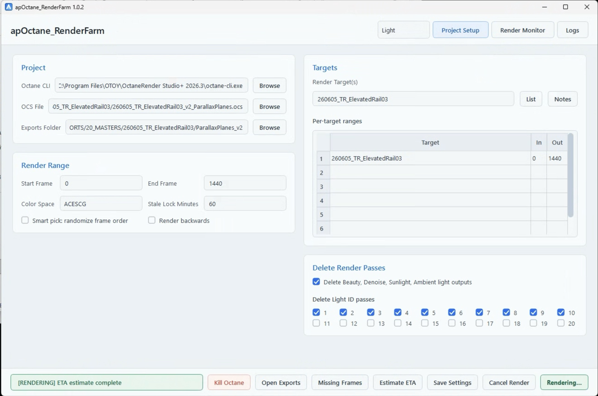
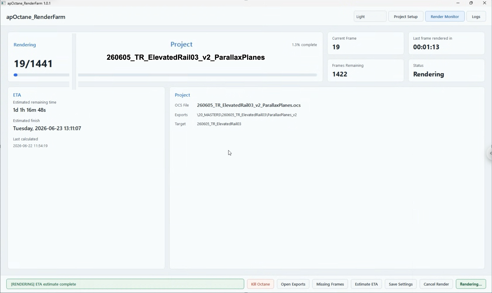
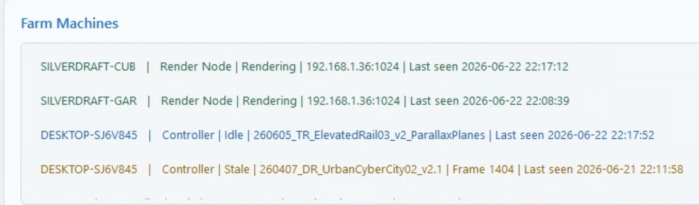

# apOctane\_RenderFarm User Guide

This guide is for artists/operators using the installed app. You do not need to run developer scripts or build the app.

## Install And Open

1. Download the latest installer from GitHub Releases.
2. Run `apOctane_RenderFarm_Setup_<version>.exe`.
3. Launch `apOctane_RenderFarm` from the Start Menu or Desktop shortcut.
4. On first launch, choose how this computer will be used.

Machine roles:

* **Single Machine**: render only on this computer. Farm-control tools stay hidden.
* **Controller**: edit projects, start queues, cancel renders, publish status, and send commands to other app machines. Controller-only machines do not need Octane CLI.
* **Controller/Worker**: do everything a Controller can do and also render `.apo` jobs locally.
* **Worker**: wait for controller commands and render `.apo` jobs without showing setup controls.
* **Daemon**: manage the OTOY Octane Network Render Node daemon. This is separate from `.apo` worker rendering.

You can change the role later in **Preferences > Workflow**.

## Project Files

Projects are saved as `.apo` files. Use:

* **File > New Project**
* **File > Open Project**
* **File > Open Recent**
* **File > Save Project**
* **File > Save Project As**

Use `Ctrl+S` to save and `Ctrl+Shift+S` to Save As.

The app starts with a blank project unless **Preferences > Reopen last project on launch** is enabled. If a project has unsaved changes, the app asks whether to save before closing, creating a new project, or opening another project.

Machine settings are separate from `.apo` project files. Installed builds store machine settings in user app data, not in `Program Files`.

## Project Setup

Use **Project Setup** to choose what should render.



Check these fields first:

* **Octane CLI**: should point to `octane-cli.exe` on Single Machine, Controller/Worker, and Worker machines. Controller-only machines do not need it.
* **Scene File**: the OCS or ORBX scene you want to render.
* **Exports Folder**: where frames, locks, and done markers will be written.
* **Render Target(s)**: scene target names, if you are not using scene-enabled targets.
* **Frame range**: Start/End frame for simple renders, or per-target In/Out rows when targets need different ranges.

The project queue can hold multiple scenes. Use the **Render** checkbox beside each scene to keep scenes loaded while rendering only selected scenes.

When adding a new OCS/ORBX scene, render passes default to kept so you do not accidentally delete outputs during setup.

Use **Add / Update This Machine** if this computer needs its own local project/export roots. This dialog is intentionally explicit: use **Browse** to choose Project Root, Exports Root, and Farm Directory. **Test Paths** is read-only and does not create missing folders. If the Farm Directory, `_farm_status`, or `_farm_control` is wrong or missing, the test should fail so you can fix the path before saving.

Use **Tools > Test This Machine** before unattended rendering. It checks important paths and produces copyable diagnostics.

## Targets And Overrides

The render target table can include:

* Target name.
* Keep checkbox.
* In/Out range.
* Custom range.
* Samples.
* Width.
* Height.
* Color space.

For OCS files, target metadata is read directly from the scene where possible. ORBX inspection can be slower and depends on Octane's scene API, so confirm target samples/resolution/color values after import.

Use overrides only when you intentionally want to change scene settings:

* Samples.
* Width.
* Height.
* Color space.
* Overwrite completed frames.

Before rendering, the app shows a **What will happen** confirmation. If risky settings are active, it lists them so you can cancel before launching Octane.

In **Multiple Machines** mode, active overrides get an extra warning because every selected machine should be expected to use the same override settings.

## Render Pass Cleanup

The rule is simple:

```
Checked = keep
Unchecked = delete
```

Keepable outputs:

* Beauty.
* Denoise.
* Sunlight.
* Ambient light.
* Light IDs 1 through 20.

Unchecked passes are deleted by the Lua render script after each rendered frame. If cleanup is disabled, the app does not ask the renderer to delete optional passes.

## Dry Run And Diagnostics

Use **Dry Run** before launching a real render. It prints what will happen without starting Octane:

* Project queue.
* Active project count.
* Frame ranges.
* Targets.
* Output folder.
* Overrides.
* Delete-pass choices.
* Octane command and environment.

Use **Tools > Copy Diagnostics** for a broader support report. It includes app state, machine settings, project state, dry-run summary, command/environment info, and recent log details.

Use **Tools > Export Support Bundle** when sending a bug report. The ZIP includes logs, diagnostics, config snapshots, and current settings.

## Render Monitor

Use **Render Monitor** while `.apo` controller/worker rendering is running.



This page shows:

* Current project.
* Current frame.
* Progress.
* Frames remaining.
* Last frame render time.
* ETA summary.
* Project queue.
* Last frame preview.
* Farm machine status.

Status colors:

* Green: rendering.
* Yellow: ready/available.
* Red: offline, stale, canceled, failed, or needs attention.

## Preview

Use **Preview** to inspect rendered output without leaving the app.

The preview has three modes:

* **Live Render**: shows the latest rendered frame the app can find. This follows the last completed frame, so backward or smart-pick renders show the most recently finished frame rather than the numerically highest frame.
* **Frame Playback**: scrubs and plays cached preview images.
* **Video Playback**: plays generated proxy or full-res preview videos.

EXR frames are converted into preview cache images in `_preview_cache`. JPEG at quality 92 is the default because it is much smaller than PNG and is usually enough for playback and inspection. PNG can be selected in Preferences when lossless cache frames are needed. Cache conversion uses automatic parallelism tuned by machine role so high-core controllers stay fast without exposing a manual thread count.

Useful controls:

* **Reveal Cache** opens the image cache in Live Render or Frame Playback, and opens the video cache in Video Playback.
* **Clear Cache** deletes image preview cache files after confirmation.
* **Clear Video Cache** deletes generated preview videos after confirmation.
* **Fullscreen** opens a larger playback window with the same play, loop, navigation, and zoom controls.
* **Space** plays or pauses.
* **Left/Right Arrow** steps through frames.
* **Command/Ctrl `=`** zooms in.
* **Command/Ctrl `-`** zooms out.
* Trackpad pinch zoom works where Qt reports a real pinch gesture.

The preferred preview pass is set in **Preferences > Preview > Preferred Pass**. If you enter a pass name such as `Output AOV 5`, `AOV 6`, `Emission`, or `Light ID 18`, the app uses only that pass when it exists. If it does not exist yet, the app waits instead of using a different pass.

The cache status text shows the current cache pass and cached frame count when known. While the app is converting EXRs, it shows **Creating Cache...** and keeps the rest of the Preview UI usable. Long cache jobs show a progress window with **Cancel**. Cancel stops safely between frames, after the current EXR conversion finishes, and keeps any cache files that were already created.

Preview is hidden for **Daemon** machines because Octane Network Render Node daemon work does not produce `.apo` frame output for this app to inspect.

## Logs And Tools

Use **Logs** for:

* Live Octane output.
* Missing-frame reports.
* ETA reports.
* Diagnostics.

Useful tools:

* **Dry Run**: validates settings and prints the render plan without launching Octane.
* **Missing Frames**: scans output folders for gaps.
* **Estimate ETA**: estimates remaining render time from completed frames.
* **Copy Diagnostics**: copies support info to the clipboard.
* **Export Support Bundle**: creates a ZIP with logs, diagnostics, config, and current settings.
* **Reveal App Data Folder**: opens the folder containing machine settings, logs, and support output.
* **Reveal Project**: opens the current `.apo` project location.
* **Reveal Release Folder**: opens the local staged release folder when available.

## Farm Machines

Farm machine status appears in the monitor.



Roles:

* **Controller**: a running app that can start queues and send/receive farm commands.
* **Controller/Worker**: a running app that can start farm jobs and render project frames.
* **Worker**: a running app waiting for controller commands.
* **Daemon**: a running app managing an OTOY Octane Network Render Node daemon.

Common states:

* **Ready**: available.
* **Rendering**: actively rendering or connected.
* **Idle**: app is running but not rendering.
* **Offline**: no daemon process found or machine is not reporting.
* **Stale**: status has not updated recently. This usually means the app is closed, the shared folder is not syncing, or the machine has not written a heartbeat within the stale timeout.

## Controller

Use this role on the computer where you prepare jobs.

Typical controller workflow:

1. Open or create an `.apo` project.
2. Add one or more scenes to the queue.
3. Check the **Render** box only for scenes you want to render now.
4. Click **Start Queue**.
5. In Multiple Machines mode, choose which app machines should receive the command.
6. Review the command summary.
7. Click OK.

The command summary and bottom status bar include storage estimates when enough information is available. Early estimates are intentionally cautious because the app has only a few rendered frames to sample. Treat the first 1% as a rough guide, expect the estimate to settle by around 5%, and expect it to be very accurate by roughly 15% when frame sizes are consistent. The app warns about low disk space, but the controller can still start the render after you review the warning.

The command is written into the shared Farm Control Folder. Target machines claim it, start only if idle, and write a result such as `started`, `busy`, `failed`, or `ignored`.

Controllers can also send **Cancel Render** and **Start Daemon** commands to selected machines.

## Mobile / Public Status

Use **Preferences > Mobile / Public Status** to publish a condensed farm status document to a web endpoint. This is useful for checking farm progress from a phone.

For the Sim-Plates Cloudflare Worker setup:

```
Publish URL: https://sim-plates-farm-status.alex-6ab.workers.dev
Token secret name: FARM_STATUS_WRITE_TOKEN
Public page: https://docs.sim-plates.com/farm-status/
```

The Token field should contain the Worker secret value, not the secret name. The app sends it in the `X-Farm-Status-Token` header.

Use **Test Publish** after entering the URL and token. If it fails, check the URL, token, internet connection, and whether the Worker secret was updated in Cloudflare.

## Controller/Worker

Use this role on a render PC that should both control the farm and render project jobs. This is useful when the main render machine is also the place where an operator sometimes starts or cancels jobs.

Controller/Worker machines need a valid Octane CLI path.

## Worker

Use this role on a computer that should render `.apo` jobs sent by a controller.

Worker setup:

1. Install and open the app.
2. Choose **Worker** on first launch, or set it in Preferences.
3. Confirm machine settings point to local Octane, project root, exports root, and shared status/control folders.
4. Leave the app open.

The worker opens to the monitor and waits for controller commands. Project setup controls are hidden so the machine behaves like a render endpoint.

## Daemon

Use this role for OTOY Octane Network Render Node daemon work. This is not the same as rendering `.apo` project frames directly.

Daemon setup:

1. Install the OTOY Octane Network Render Node package from OTOY Downloads.
2. Open `apOctane_RenderFarm`.
3. Choose **Daemon** on first launch, or set it in Preferences.
4. Use **Install Daemon** if the OTOY package is present but the daemon is not installed.
5. Enable **Start Daemon on launch** in Preferences if this machine should automatically start the daemon when the app opens.
6. Click **Start Daemon**.

The app scans:

```
C:\Program Files\OTOY
```

for folders like:

```
OctaneRender Studio+ Network Render Node 2025.1
OctaneRender Studio+ Network Render Node 2025.2
OctaneRender Studio+ Network Render Node 2026.1
```

If multiple installable daemon versions are found, the app asks which one to install. Starting the daemon runs the installed daemon command. If the daemon is already ready, the Start button changes to **Daemon Ready** and is disabled.

Daemon controls:

* **Start Daemon**: launch the installed daemon.
* **Kill Daemon**: stop Octane node daemon processes after confirmation.
* **Install Daemon**: run the selected OTOY daemon installer script.
* **Uninstall Daemon**: run the selected OTOY daemon uninstall script.
* **Reveal OTOY Folder**: open `C:\Program Files\OTOY`.
* **OTOY Downloads**: open the OTOY downloads page.

When closing the app while a daemon is running, the app asks whether to close the daemon or leave it running in the background.

## Daemon Monitor

When the machine role is **Daemon**, the monitor becomes **Daemon Monitor**.

It intentionally hides `.apo` render cards such as ETA, Last Frame, and Project Queue. It shows:

* Daemon status.
* PID.
* Executable path.
* Installed OTOY folders.
* Detected daemon commands.
* Start-on-launch preference.
* Farm Machines.

Daemon status colors:

* Yellow: ready.
* Green: rendering/connected.
* Red: offline or needs attention.

The app can briefly see `octane_node.exe` while the daemon gathers information. It waits before treating that as real rendering so the monitor does not flash green during normal startup.

## Farm Control Folder

The Farm Control Folder is a shared directory used for controller/worker commands. It is normally auto-derived near the shared exports/status folders:

```
...\20_MASTERS\_farm_control
```

It contains:

* `commands`: new commands from controllers.
* `claims`: machine claim files.
* `results`: machine command results.
* `archive`: reserved for later cleanup.

In Preferences, leave this field on **Auto** unless you need a custom shared path. Use **Reveal** to open the resolved folder for debugging.

## Farm Directory

The Farm Directory is the stable shared folder that contains:

```
_farm_status
_farm_control
```

This should normally be the same for all projects and all participating machines. Project Root and Exports Root can be local to each machine, but the Farm Directory must resolve to the same shared Dropbox/network location so machines can see each other's status and commands.

## Mobile / Public Status

Controller and Controller/Worker machines can publish a phone-friendly farm status page.

In **Preferences > Mobile / Public Status**:

1. Enable **Publish farm status to a web endpoint**.
2. Enter the Publish URL.
3. Enter the optional token when the endpoint requires one.
4. Click **Test Publish**.

For the Sim-Plates Cloudflare Worker:

```
Publish URL: https://sim-plates-farm-status.alex-6ab.workers.dev
Token secret name in Cloudflare: FARM_STATUS_WRITE_TOKEN
Public page: https://docs.sim-plates.com/farm-status/
```

The token value in the app must match the Cloudflare Worker secret value. If you reset the secret, paste the new value into the app too. The app sends the token as `X-Farm-Status-Token`.

## If Something Looks Wrong

Try these in order:

1. Run **Dry Run**.
2. Run **Tools > Test This Machine**.
3. Use **Tools > Copy Diagnostics**.
4. Use **Tools > Export Support Bundle**.
5. Confirm the OCS/ORBX file, exports folder, and render target names are correct.
6. Confirm each farm machine can read/write the shared exports, status, and control folders.
7. For daemon machines, confirm OTOY Network Render Node is installed under `C:\Program Files\OTOY`.

If a render seems stuck, check whether another machine is holding a lock or whether the machine status has gone stale.
