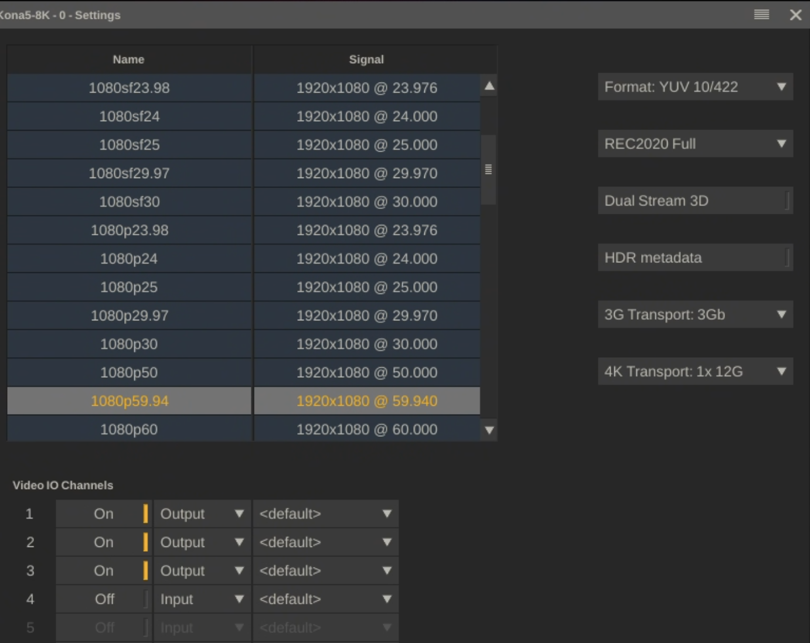

# HDR via SDI

If you are going out SDI to the LED Processor or an HDR Monitor, you can skip all Windows and Nvidia settings.  

The main thing you need to make sure is that the SDI cable(s) is 6g or ideally 12g sdi (capable of carrying 10bit signal).

In Video IO settings, make sure that format is at least YUV 10/422 (10 bit).

<figure><figcaption></figcaption></figure>

In Settings > Monitors, make sure to set your monitor to PQ or HLG (depending on your workflow)

<figure><figcaption></figcaption></figure>

In your LED processor or TV, make sure to set the signal to be PQ or HLG (depending on your workflow).
