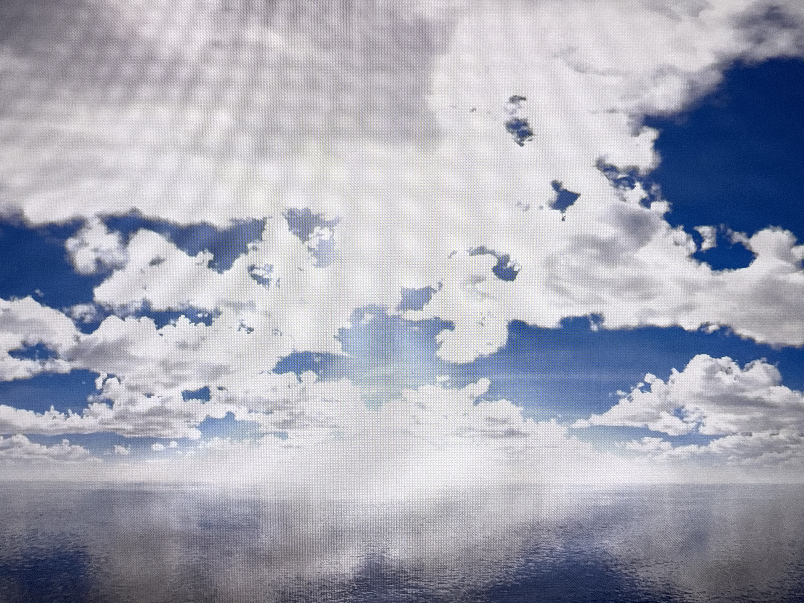

# HDR with Windows Consumer Monitor in 9.9

Consumer TV Consumer TVs (or HDR-capable laptop displays) act differently.\
1\. Go to Settings>System>Display and make sure HDR is turned on.&#x20;

The shortcut to toggle HDR on and off is Windows+Shift+B.

<figure><figcaption></figcaption></figure>

2. Go to Nvidia Control Panel, and under "Change Resolution" (or in Mosaic Settings, if you are using Nvidia Mosaic), choose an output color depth of at least 10 bpc. \
   \
   Although confusing, the Desktop Color Depth does not need to be set to HDR to use the HDR monitor. \
   \
   \*HOWEVER, if you have true HDR content, you will need to use these settings to playback HDR properly: \
   \
   **Desktop Color Settings:HDR (64-bit)** \
   **Output Color Depth: At least 10 bpc**\
   **Output Dynamic Range: Full** 

<figure><figcaption></figcaption></figure>

\*If you cannot change these settings, or you get weird artifacts when trying to change, your cables or HDMI adapters may not be good enough to do proper HDR 10 bit.

<figure><figcaption></figcaption></figure>

Notice above that the Sun disk is not visible and the highlights are blown out, this is with SDR(64-Bit)

<figure><figcaption></figcaption></figure>

Now with the same settings everywhere else, by changing the settings to HDR(64-Bit), we can see the Sun and make out a lot more detail in the highlights. \
 

4. Make sure your media is flagged correctly, if using an HDRi, sRGB Scene Linear for example

<figure><figcaption></figcaption></figure>

5.  Go to Video IO, and enable the Monitor(s) you want to use. Choose Format, at least 10-bit Rec2020 PQ. \
     

    <figure><figcaption></figcaption></figure>

6. Under Settings>Monitors, set the Dual Head to \
   Rec 709 (or 2020 if you're going to 2020)\
   Set to PQ or HLG (Depending on your workflow) 

<figure><figcaption></figcaption></figure>

5. You will likely need to bring down the gamma to around .5 for the content look correct and may need to gain up.\
   \
   In this example, the background should look very close to black, not lifted purple. By adjusting the gamma by .5, this gets us back to the appropriate setting. This applies to both HDR and SDR content. \
   .png>).png>) 
